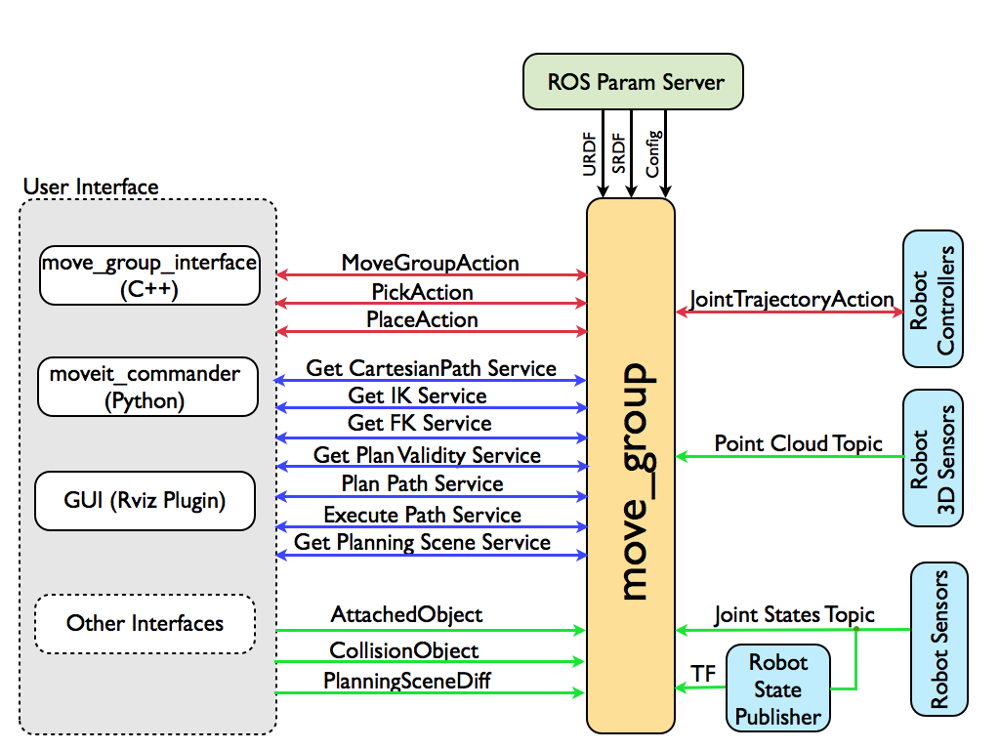
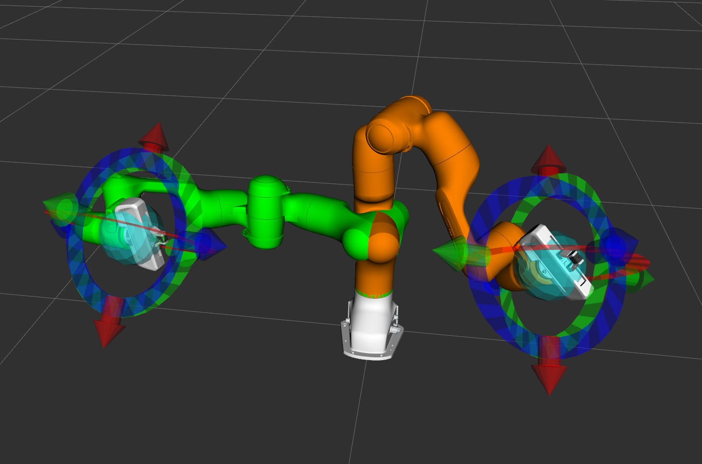
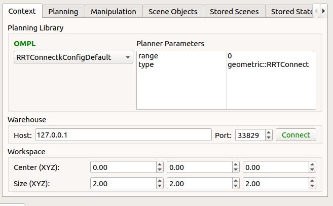
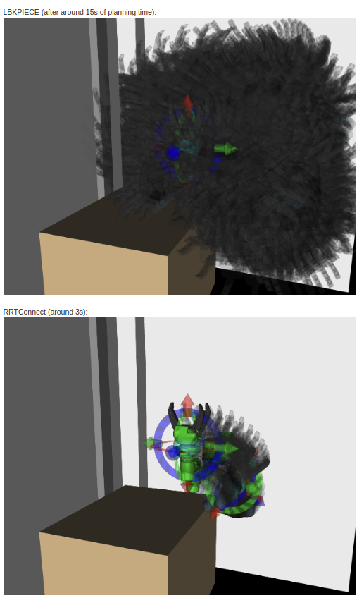
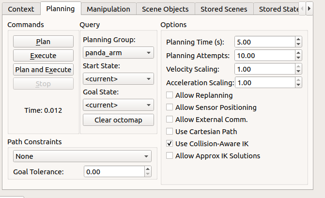
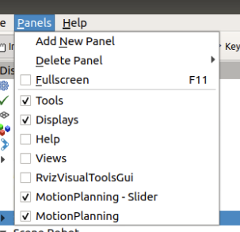
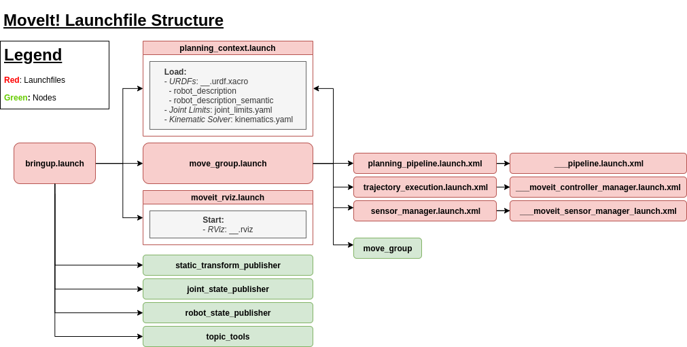
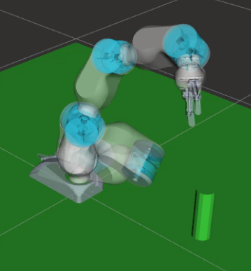

# MoveIt! Crash Course

Author: methylDragon  
Some personal notes regarding the use of the MoveIt! package  
Just following through tutorials and filling in gaps or other handy information along the way   
I'll be adapting it from the MoveIt! Tutorials: <https://ros-planning.github.io/moveit_tutorials/>    

------

## Pre-Requisites

- A system with Ubuntu 18.04 installed
  - I'll assume we're using ROS Melodic
  - ROS knowledge
  - Catkin knowledge
- Linux
- Python 3 and/or C++


## Table Of Contents


## Introduction

The MoveIt! project is a ROS package that helps with motion planning for robotic manipulators. As such, it is especially useful for working with and planning for arms!

Features:

> - Motion Planning
>   - Generate high-degree of freedom trajectories through cluttered environments and avoid local minimums
> - Manipulation
>   - Analyze and interact with your environment with grasp generation
> - Inverse Kinematics
>   - Solve for joint positions for a given pose, even in over-actuated arms
> - Control
>   - Execute time-parameterized joint trajectories to low level hardware controllers through common interfaces
> - 3D Perception
>   - Connect to depth sensors and point clouds with Octomaps
> - Collision Checking
>   - Avoid obstacles using geometric primitives, meshes, or point cloud data
>
> <https://moveit.ros.org/>

This tutorial will only cover the basics for MoveIt!, up to and including the move_group interface. It won't cover the implementations of that interface, or any other deeper APIs, such as the pick and place pipeline, or time parametrisation.


## Setup and Basic Concepts

### Installing MoveIt!

```shell
$ sudo apt install ros-melodic-moveit
```


### Basic Concepts

Source: <https://moveit.ros.org/documentation/concepts/>

#### **System Architecture**



#### **Move Group**

> ### The move_group node
>
> The figure above shows the high-level system architecture for the primary node provided by MoveIt called [move_group](http://docs.ros.org/melodic/api/moveit_ros_move_group/html/move__group_8cpp.html). This node serves as an integrator: pulling all the individual components together to provide a set of ROS actions and services for users to use.

#### **User Interfaces**

- C++ API
  - [move_group_interface](<http://docs.ros.org/melodic/api/moveit_ros_planning_interface/html/classmoveit_1_1planning__interface_1_1MoveGroupInterface.html>) Package
- Python API
  - [moveit_commander](<http://docs.ros.org/melodic/api/moveit_commander/html/classmoveit__commander_1_1move__group_1_1MoveGroupCommander.html>) Package
- GUI
  - Motion Planning plugin on RViz

#### **Configuration**

- URDF
  - From robot_description parameter
- SRDF
  - From robot_description_semantic parameter
- Other parameters
  - Joint limits, kinematics, motion planning, perception, etc.

#### **Robot Interfaces**

- Joint state
  - Keeps track of the state of each joint; represented on the `/joint_states` topic
  - You need a joint_state_publisher node to publish these
- Transform
  - TF transforms
  - You need a robot_state_publisher to handle these
- Controllers
  - ROS action interface. A server on the robot needs to service the action via the `FollowJointTrajectoryAction` interface
  - MoveIt will create the Client only
- Planning Scene
  - The planning scene represents the world and the current state of the robot. (Carried objects by the robot are assumed to be rigidly attached to the robot.)
- Extensibilty
  - Pick and place, kinematics, and motion planners are implemented as plugins.
  - Plugins are configurable using .yaml parameters.

#### **Motion Planning**

> ### **The Motion Planning Plugin**
>
> MoveIt works with motion planners through a *plugin* interface. This allows MoveIt to communicate with and use different motion planners from multiple libraries, making MoveIt easily extensible. The interface to the motion planners is through a ROS Action or service (offered by the *move_group* node). The default motion planners for move_group are configured using OMPL and the MoveIt interface to OMPL by the MoveIt Setup Assistant.
>
> ### **The Motion Plan Request**
>
> The motion plan request clearly specifies what you would like the motion planner to do. Typically, you will be asking the motion planner to move an arm to a different location (in joint space) or the end-effector to a new pose. Collisions are checked for by default (including self-collisions). You can *attach* an object to the end-effector (or any part of the robot), e.g. if the robot picks up an object. This allows the motion planner to account for the motion of the object while planning paths. You can also specify constraints for the motion planner to check - the inbuilt constraints provided by MoveIt are *kinematic constraints*:
>
> - Position constraints - restrict the position of a link to lie within a region of space
> - Orientation constraints - restrict the orientation of a link to lie within specified roll, pitch or yaw limits
> - Visibility constraints - restrict a point on a link to lie within the visibility cone for a particular sensor
> - Joint constraints - restrict a joint to lie between two values
> - User-specified constraints - you can also specify your own constraints with a user-defined callback.
>
> ### **The Motion Plan Result**
>
> The move*group node will generate a desired trajectory in response to your motion plan request. This trajectory will move the arm (or any group of joints) to the desired location. Note that the result coming out of move_group is a trajectory and not just a path - _move_group* will use the desired maximum velocities and accelerations (if specified) to generate a trajectory that obeys velocity and acceleration constraints at the joint level.
>
> <https://moveit.ros.org/documentation/concepts/>

There's also a motion planning pipeline! There's pre-processing (correction of the robot before planning, or specification of the workspace), and post-processing (refinement of the motion plan, time parameterisation for the plan, for example.)


I've covered a couple of basics, but there's a lot more to cover! Check out the [link](<https://moveit.ros.org/documentation/concepts/>)!


### MoveIt! In RViz

Source: <https://ros-planning.github.io/moveit_tutorials/doc/quickstart_in_rviz/quickstart_in_rviz_tutorial.html>

#### **Run the Demo Launch File**

```shell
$ roslaunch panda_moveit_config demo.launch rviz_tutorial:=true
```

It should open up an empty Rviz world. Click `Add` and select the `MotionPlanning` display type to add the controller.


#### **Configure the MotionPlanning interface**

> - Once you have the Motion Planning Plugin loaded, we can configure it. In the “Global Options” tab of the “Displays” subwindow, set the **Fixed Frame** field to `/panda_link0`
> - Now, you can start configuring the Plugin for your robot (the Panda in this case). Click on “MotionPlanning” within “Displays”.
>   - Make sure the **Robot Description** field is set to `robot_description`.
>   - Make sure the **Planning Scene Topic** field is set to `/planning_scene`. Click on topic name to expose topic-name drop-down.
>   - In **Planning Request**, change the **Planning Group** to `panda_arm`.
>   - In **Planned Path**, change the **Trajectory Topic** to `/move_group/display_planned_path`.


#### **Interact with the Arm!**

Now you can play with the arm by selecting the `Interact` tool and moving the arm where you want it to go.

You'll be able to change both the start and ending state for the robot arm by moving the end manipulator around using the interact tool!

- **Green** is the **start** state
  - **You won't be able to see the manipulatable start state by default!**
  - Enable it by checking `Query Start state` in the `Planning Request` tab
- **Orange** is the **end** state
- **Collisions** will be shown in **red**
- You might also want to uncheck the `Show Robot Visual` checkbox in the `Scene Robot` tab to only leave the starting and ending state visuals




#### **Configure The Planners**

The MotionPlanning plugin has a few nifty configuration settings that you can use. But the first more important step is to choose the planner to use.

> **The default planner is pretty so-so.** I personally prefer to use **RRTConnect**. But this sort of thing is not a one-size fits all thing.
>
> 
>
> You can see the difference haha..
>
> 

You can then swap over to the `Planning` tab and configure a bunch of other parameters as well!



- **Use Cartesian Path**
  - The planner will only cause the manipulator to move in a striaght line
- **Use Collision-Aware IK**
  - The planner will plan with collision avoidance in mind
  - Without this enabled the planner will be okay with paths that result in collisions (even self-collisions) occuring!


#### **Planning**

Now you can click on the shiny `Plan` button and watch the planned path play out in an animation.

You can also enable the `Show Trail` checkbox in the `Planned Path` tab to show the trails.

> If you enable the Slider, you can introspect the trajectory waypoints too!
>
> 

> Do remember if you change the position of the end effector to **replan the path!**


### Launchfile Structure



It's fairly complicated because there are a whole bunch of nodes and configuration files flying around.

- **bringup.launch**
  - Brings up everything
  - In the demo it's called demo.launch
- **planning_context.launch**
  - Defines the arm and all the relevant configurations for the planner to work with
    - Most of the configurations loaded here are found in the `/config` directory
- **move_group.launch**
  - Sets up planners, executors, and sensor managers
  - Also sets up the action server that will take in and execute goals
  - Calls a bunch of other launch.xml files (which act as easier ways to call any defined launch files)
- **moveit_rviz.launch**
  - Starts RViz
- **TF and other miscellaneous nodes**
  - Helps to define the TF tree (especially important for a simulated robot with no true TF publishers)
  - Also helps keep track of the joint states
  - And does some relaying for relevant topics
    - Specifically joint_states to joint_states_desired


### Command Line Interface

```shell
# Start the command line interface
$ rosrun moveit_commander moveit_commander_cmdline.py
```

Now you can connect and run commands!

```shell
# Initialise group for commanding
$ use <group name>

# Get current state of group
$ current

# Record state (in this case as the variable c)
$ rec c

# Play back state
$ goal = c
$ go goal

# Play back state but with modified joint value
$ goal = c
$ goal[0] = 0.2
$ go goal

# Plan then execute instead
$ goal[0] = 0.2
$ goal[1] = 0.2
$ plan goal
$ execute
```


## C++ Move Group Interface

Source: <https://ros-planning.github.io/moveit_tutorials/doc/move_group_interface/move_group_interface_tutorial.html>

Code Source: <https://github.com/ros-planning/moveit_tutorials/blob/master/doc/move_group_interface/src/move_group_interface_tutorial.cpp>

Of course, all this planning is useless without some programmatic way to call it for even more powerful interfacing with ROS! So let's get to it!

> MoveIt! operates on sets of joints called “planning groups” and stores them in an object called the JointModelGroup. Throughout MoveIt! the terms “planning group” and “joint model group” are used interchangably.

### Import Dependencies

```c++
#include <moveit/move_group_interface/move_group_interface.h>
#include <moveit/planning_scene_interface/planning_scene_interface.h>

#include <moveit_msgs/DisplayRobotState.h>
#include <moveit_msgs/DisplayTrajectory.h>

#include <moveit_msgs/AttachedCollisionObject.h>
#include <moveit_msgs/CollisionObject.h>

#include <moveit_visual_tools/moveit_visual_tools.h>
```


### Define Planning Groups

```c++
static const std::string PLANNING_GROUP = "panda_arm";

// Define Interfaces
moveit::planning_interface::MoveGroupInterface move_group(PLANNING_GROUP);
moveit::planning_interface::PlanningSceneInterface planning_scene_interface;

// Get Joint Model Group
const robot_state::JointModelGroup* joint_model_group = move_group.getCurrentState()->getJointModelGroup(PLANNING_GROUP);
```

- The `MoveGroupInterface` is the object that you want to plan and control
- The `PlanningSceneInterface` allows you to add and remove collision objects in the world


### Obtain Basic Information

```c++
// Get robot reference frame
ROS_INFO_NAMED("tutorial", "Planning frame: %s", move_group.getPlanningFrame().c_str());

// Get end-effector link
ROS_INFO_NAMED("tutorial", "End effector link: %s", move_group.getEndEffectorLink().c_str());

// Get all groups in the robot
ROS_INFO_NAMED("tutorial", "Available Planning Groups:");
std::copy(move_group.getJointModelGroupNames().begin(), move_group.getJointModelGroupNames().end(),
          std::ostream_iterator<std::string>(std::cout, ", "));
```


### Setting Start State

```c++
// Create start state object
robot_state::RobotState start_state(*move_group.getCurrentState());
geometry_msgs::Pose start_pose2;

// Create starting pose
start_pose2.orientation.w = 1.0;
start_pose2.position.x = 0.55;
start_pose2.position.y = -0.05;
start_pose2.position.z = 0.8;

// Calculate and set start state object
start_state.setFromIK(joint_model_group, start_pose2);

// Assign start state to move_group
move_group.setStartState(start_state);
```


### Assign and Plan for End Effector Pose Goal

```c++
// Create Goal Pose
geometry_msgs::Pose target_pose1;
target_pose1.orientation.w = 1.0;
target_pose1.position.x = 0.28;
target_pose1.position.y = -0.2;
target_pose1.position.z = 0.5;

// Set Goal Pose
move_group.setPoseTarget(target_pose1);

// Create Planner
moveit::planning_interface::MoveGroupInterface::Plan my_plan;

// Check if Successful
// (Note this DOES NOT move the robot! Just plans for the movement)
bool success = (move_group.plan(my_plan) == moveit::planning_interface::MoveItErrorCode::SUCCESS);

ROS_INFO_NAMED("tutorial", "Visualizing plan (pose goal) %s", success ? "" : "FAILED");
```

> Compute a motion plan that takes the group declared in the constructor from the current state to the specified target. No execution is performed. The resulting plan is stored in *plan*.


### Move to Goal (Execute Plan)

```c++
move_group.move();
```


### Assign and Plan for Joint-Space Pose Goal

```c++
// Get current state object
// This contains all the position, velocity, and acceleration data
moveit::core::RobotStatePtr current_state = move_group.getCurrentState();

// Get current state as a vector
std::vector<double> joint_group_positions;
current_state->copyJointGroupPositions(joint_model_group, joint_group_positions);

// Edit the vector
joint_group_positions[0] = -1.0;  // radians

// Set new target
move_group.setJointValueTarget(joint_group_positions);

// Plan and Check if Successful
bool success = (move_group.plan(my_plan) == moveit::planning_interface::MoveItErrorCode::SUCCESS);

ROS_INFO_NAMED("tutorial", "Visualizing plan (pose goal) %s", success ? "" : "FAILED");
```


### Assign and Plan for Cartesian Paths

Waypoint navigation!

```c++
// Create waypoints
std::vector<geometry_msgs::Pose> waypoints;
waypoints.push_back(start_pose2);

geometry_msgs::Pose target_pose3 = start_pose2;

target_pose3.position.z -= 0.2;
waypoints.push_back(target_pose3);  // down

target_pose3.position.y -= 0.2;
waypoints.push_back(target_pose3);  // right

target_pose3.position.z += 0.2;
target_pose3.position.y += 0.2;
target_pose3.position.x -= 0.2;
waypoints.push_back(target_pose3);  // up and left

// Reduce robot speed
move_group.setMaxVelocityScalingFactor(0.1);

// Set resolution
moveit_msgs::RobotTrajectory trajectory;
// No jump thresholding. THIS IS DANGEROUS ON A REAL ROBOT
const double jump_threshold = 0.0;
const double eef_step = 0.01; // 1cm resolution

// Compute path
double fraction = move_group.computeCartesianPath(waypoints, eef_step, jump_threshold, trajectory);
ROS_INFO_NAMED("tutorial", "Visualizing plan (Cartesian path) (%.2f%% acheived)", fraction * 100.0);
```

> Configurations are computed for every eef_step meters; The jump_threshold specifies the maximum distance in configuration space between consecutive points in the resultingpath. The return value is a tuple: a fraction of how much of the path was followed, the actual RobotTrajectory.
>
> <http://docs.ros.org/melodic/api/moveit_commander/html/classmoveit__commander_1_1move__group_1_1MoveGroupCommander.html>


### Planning Constraints

This particular constraint limits the end-effector to a single orientation. So the arm has to hold that orientation all the way.

```c++
// Create constraint
moveit_msgs::OrientationConstraint ocm;
ocm.link_name = "panda_link7";
ocm.header.frame_id = "panda_link0";
ocm.orientation.w = 1.0;
ocm.absolute_x_axis_tolerance = 0.1;
ocm.absolute_y_axis_tolerance = 0.1;
ocm.absolute_z_axis_tolerance = 0.1;
ocm.weight = 1.0;

// Populate and set constraint
moveit_msgs::Constraints test_constraints;
test_constraints.orientation_constraints.push_back(ocm);
move_group.setPathConstraints(test_constraints);

// Give planner more time to plan
move_group.setPlanningTime(10.0);

// Then execute the new plan!
move_group.setPoseTarget(target_pose1);
success = (move_group.plan(my_plan) == moveit::planning_interface::MoveItErrorCode::SUCCESS);
ROS_INFO_NAMED("tutorial", "Visualizing plan 3 (constraints) %s", success ? "" : "FAILED");

// Visualise!
visual_tools.deleteAllMarkers();
visual_tools.publishAxisLabeled(start_pose2, "start");
visual_tools.publishAxisLabeled(target_pose1, "goal");
visual_tools.publishText(text_pose, "Constrained Goal", rvt::WHITE, rvt::XLARGE);
visual_tools.publishTrajectoryLine(my_plan.trajectory_, joint_model_group);
visual_tools.trigger();
visual_tools.prompt("next step");
```

> Remember to clear the path constraint when you're done with it
>
> ```c++
> move_group.clearPathConstraints();
> ```


### Collision Objects



#### **Creating Collision Objects**

> **Note:** Redeclaring collision objects under the same ID **replaces** the originally defined object! This is pretty handy!

```c++
// Create collision object
moveit_msgs::CollisionObject collision_object;
collision_object.header.frame_id = move_group.getPlanningFrame();
collision_object.id = "box1";

// Define 3D box
shape_msgs::SolidPrimitive primitive;
primitive.type = primitive.BOX;
primitive.dimensions.resize(3);
primitive.dimensions[0] = 0.4;
primitive.dimensions[1] = 0.1;
primitive.dimensions[2] = 0.4;

geometry_msgs::Pose box_pose;
box_pose.orientation.w = 1.0;
box_pose.position.x = 0.4;
box_pose.position.y = -0.2;
box_pose.position.z = 1.0;

// Populate the collision object data
collision_object.primitives.push_back(primitive);
collision_object.primitive_poses.push_back(box_pose);
collision_object.operation = collision_object.ADD;

std::vector<moveit_msgs::CollisionObject> collision_objects;
collision_objects.push_back(collision_object);

// Add collision object to the world
ROS_INFO_NAMED("tutorial", "Add an object into the world");
planning_scene_interface.addCollisionObjects(collision_objects);
```

**Now you can plan a trajectory around the object!** Just plan normally, the arm will consider the object in place.

#### **Attaching and Detaching Collision Objects**

```c++
// Attach
move_group.attachObject(collision_object.id);

// Detach
move_group.detachObject(collision_object.id);
```

#### **Removing Collision Objects**

```c++
std::vector<std::string> object_ids;
object_ids.push_back(collision_object.id);
planning_scene_interface.removeCollisionObjects(object_ids);
```


### Setting Tolerances

> Note that this is for **planning not execution**!

```c++
move_group.setGoalJointTolerance();
move_group.setGoalOrientationTolerance();
move_group.setGoalPositionTolerance();
move_group.setGoalTolerance(); // This sets all tolerances

move_group.setPlanningTime();
```


### Visualisation Tools

RViz has a lot of cool programmatic visualisation tools you can use too!

```c++
// Setup RViz Visualisation tools
namespace rvt = rviz_visual_tools; // This is just an alias for the namespace
moveit_visual_tools::MoveItVisualTools visual_tools("panda_link0");

visual_tools.deleteAllMarkers(); // Reset marker
visual_tools.loadRemoteControl(); // Initialise programmatic control

// Publishing to visual_tools causes objects to appear in RViz
// In this case we configure a text placeholder to display text above the arm
Eigen::Isometry3d text_pose = Eigen::Isometry3d::Identity();
text_pose.translation().z() = 1.75;
visual_tools.publishText(text_pose, "MoveGroupInterface Demo", rvt::WHITE, rvt::XLARGE);

// Trigger causes the text to be displayed
// It's like a publish call!
visual_tools.trigger();

// Prompt for input
visual_tools.prompt("Press 'next' in the RvizVisualToolsGui window to continue the demo");

// Visualise a plan
ROS_INFO_NAMED("tutorial", "Visualizing plan 1 as trajectory line");
visual_tools.publishAxisLabeled(target_pose1, "pose1");
visual_tools.publishText(text_pose, "Pose Goal", rvt::WHITE, rvt::XLARGE);
visual_tools.publishTrajectoryLine(my_plan.trajectory_, joint_model_group);
visual_tools.trigger();
```


## Python Move Group Interface

Source: <https://ros-planning.github.io/moveit_tutorials/doc/move_group_python_interface/move_group_python_interface_tutorial.html>

Code Source: <https://github.com/ros-planning/moveit_tutorials/blob/master/doc/move_group_python_interface/scripts/move_group_python_interface_tutorial.py>

### Import Dependencies

```python
import sys
import copy
import rospy
import moveit_commander
import moveit_msgs.msg
import geometry_msgs.msg
from math import pi
from std_msgs.msg import String
from moveit_commander.conversions import pose_to_list
from moveit_msgs.msg import RobotState, Constraints, OrientationConstraint
```


### Define Planning Groups

```python
# Init node
moveit_commander.roscpp_initialize(sys.argv)
rospy.init_node('move_group_python_interface_tutorial', anonymous=True)

# Define Interfaces
robot = moveit_commander.RobotCommander()
scene = moveit_commander.PlanningSceneInterface()

# Define Move Group
group_name = "panda_arm"
move_group = moveit_commander.MoveGroupCommander(group_name)
```

- The `RobotCommander` is the object that contains information about the robot's state and kinematic model
- The `PlanningSceneInterface` allows you to add and remove collision objects in the world
- The `MoveGroupCommander` is the object that you use to control and plan for the robot


### Obtain Basic Information

```python
# Get reference frame
planning_frame = move_group.get_planning_frame()

# Get end-effector link
eef_link = move_group.get_end_effector_link()

# Get all groups in robot
group_names = robot.get_group_names()

# Get entire state
robot.get_current_state()
```


### Setting Start State

```python
# Create joint state object
joint_state = JointState()
joint_state.header = Header()
joint_state.header.stamp = rospy.Time.now()
joint_state.name = ['joint_a', 'joint_b']
joint_state.position = [0.17, 0.34]

# Assign it to a robot state
moveit_robot_state = RobotState()
moveit_robot_state.joint_state = joint_state

# Assign robot state to move_group
move_group.set_start_state(moveit_robot_state)
```


### Assign and Plan for End Effector Pose Goal

```python
# Create Goal Pose
pose_goal = geometry_msgs.msg.Pose()
pose_goal.orientation.w = 1.0
pose_goal.position.x = 0.4
pose_goal.position.y = 0.1
pose_goal.position.z = 0.4

# Set Goal Pose
move_group.set_pose_target(pose_goal)

# Obtain plan
plan = move_group.plan()

# Stop group (to prevent any residual movement)
move_group.stop()

# Clear targets
move_group.clear_pose_targets()
```


### Move to Goal (Execute Plan)

```python
# Execute a previously computed plan
move_group.execute(plan, wait=True)

# Plan, then execute the plan
move_group.go(wait=True)
move_group.go(joint_goal, wait=True) # Or for joint-space

# Stop group (to prevent any residual movement)
move_group.stop()
```


### Assign and Plan for Joint-Space Pose Goal

```python
# Get current joint values
joint_goal = move_group.get_current_joint_values()
    
# Adjust some values
joint_goal[0] = 0
joint_goal[1] = -pi/4
joint_goal[2] = 0
joint_goal[3] = -pi/2
joint_goal[4] = 0
joint_goal[5] = pi/3
joint_goal[6] = 0

# Obtain plan
plan = move_group.plan(joint_goal)
```


### Assign and Plan for Cartesian Paths

Waypoint navigation!

```python
# Create waypoints
waypoints = []

wpose = move_group.get_current_pose().pose
wpose.position.z -= scale * 0.1  # First move up (z)
wpose.position.y += scale * 0.2  # and sideways (y)
waypoints.append(copy.deepcopy(wpose))

wpose.position.x += scale * 0.1  # Second move forward/backwards in (x)
waypoints.append(copy.deepcopy(wpose))

wpose.position.y -= scale * 0.1  # Third move sideways (y)
waypoints.append(copy.deepcopy(wpose))

# Obtain plan
(plan, fraction) = move_group.compute_cartesian_path(waypoints,   # waypoints to follow
                                                     0.01,        # eef_step
                                                     0.0)         # jump_threshold

# (DO NOT SET JUMP THRESHOLD TO 0 ON REAL ROBOT)
```

> Configurations are computed for every eef_step meters; The jump_threshold specifies the maximum distance in configuration space between consecutive points in the resultingpath. The return value is a tuple: a fraction of how much of the path was followed, the actual RobotTrajectory.
>
> <http://docs.ros.org/melodic/api/moveit_commander/html/classmoveit__commander_1_1move__group_1_1MoveGroupCommander.html>


### Planning Constraints

This particular constraint limits the end-effector to a single orientation. So the arm has to hold that orientation all the way.

```python
# Create constraint
orientation_constraint = OrientationConstraint()
orientation_constraint.header = pose.header
orientation_constraint.link_name = self.arm.get_end_effector_link()
orientation_constraint.orientation = pose.pose.orientation
orientation_constraint.absolute_x_axis_tolerance = 0.4
orientation_constraint.absolute_y_axis_tolerance = 0.4
orientation_constraint.absolute_z_axis_tolerance = 0.4
orientation_constraint.weight = 1

# Populate and set constraint
upright_constraints = Constraints()
upright_constraints.name = "upright"
        
upright_constraints.orientation_constraints.append(orientation_constraint)

# Enable constraints
move_group.set_path_constraints(upright_constraints)

# Disable constraints
move_group.set_path_constraints(None)
```


### Collision Objects


#### **Creating Collision Objects**

> **Note:** Redeclaring collision objects under the same ID **replaces** the originally defined object! This is pretty handy!

```python
# Create collision object
box_pose = geometry_msgs.msg.PoseStamped()
box_pose.header.frame_id = "panda_leftfinger"
box_pose.pose.orientation.w = 1.0
box_pose.pose.position.z = 0.07 # slightly above the end effector
box_name = "box"
    
# Add collision object to the world
scene.add_box(box_name, box_pose, size=(0.1, 0.1, 0.1))

# Check if changes are reflected using the following tests!

# Test if the box is attached
attached_objects = scene.get_attached_objects([box_name])
is_attached = len(attached_objects.keys()) > 0

# Test if the box is in the scene.
# Note that attaching the box will remove it from known_objects
is_known = box_name in scene.get_known_object_names()
```

**Now you can plan a trajectory around the object!** Just plan normally, the arm will consider the object in place.

#### **Attaching and Detaching Collision Objects**

```python
# Attach
grasping_group = 'hand'
touch_links = robot.get_link_names(group=grasping_group)
scene.attach_box(eef_link, box_name, touch_links=touch_links)

# Detach
scene.remove_attached_object(eef_link, name=box_name)
```

#### **Removing Collision Objects**

```python
scene.remove_world_object(box_name)
```


### Visualisation Tools

RViz has a lot of cool programmatic visualisation tools you can use too!

> Do note that the plan() method automatically publishes the visualisation for the robot already.

```python
# Setup display trajectory publisher
display_trajectory_publisher = rospy.Publisher('/move_group/display_planned_path',
                                               moveit_msgs.msg.DisplayTrajectory,
                                               queue_size=20)

# Create trajectory message
display_trajectory = moveit_msgs.msg.DisplayTrajectory()
display_trajectory.trajectory_start = robot.get_current_state()
display_trajectory.trajectory.append(plan)

# Publish
display_trajectory_publisher.publish(display_trajectory);
```


```
                            .     .
                         .  |\-^-/|  .    
                        /| } O.=.O { |\
```

​    

------

[.png)](https://www.buymeacoffee.com/methylDragon)